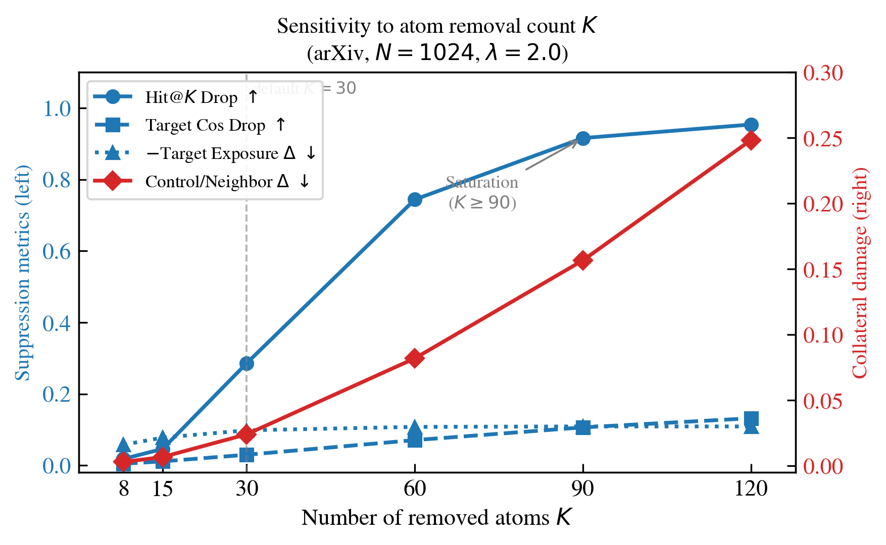
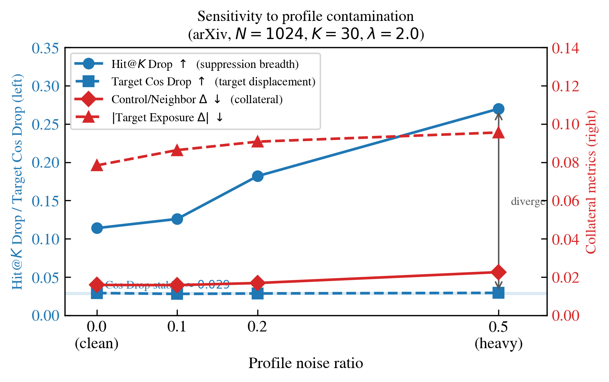
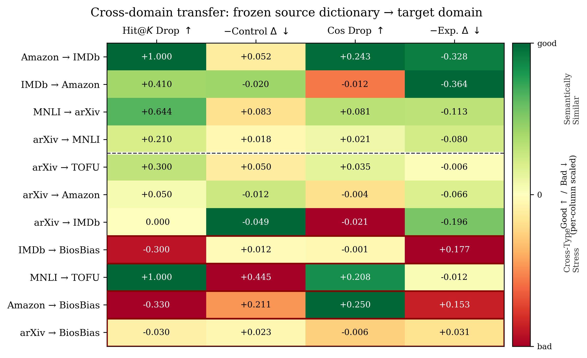
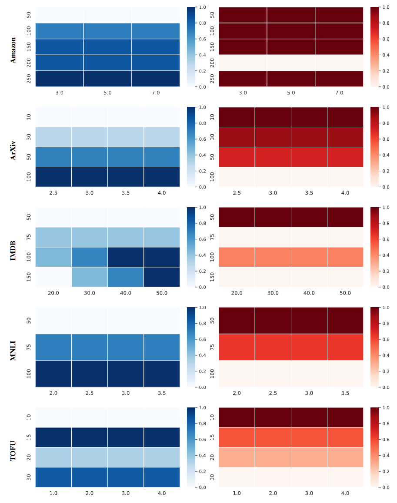

# Supplementary Tables S1--S12

This page provides supplementary tables and figures referenced in the rebuttal for **C2U**.

Unless otherwise noted, the default setting is **arXiv** with **$N=1024$, $K=30$, $\lambda=2.0$, and $n_{\text{profile}}=20$**.

**Metric conventions.** We use a consistent naming scheme across all tables:
- **Hit@K Drop ↑**: larger values indicate stronger target suppression.
- **Control Delta ↓**: smaller values indicate less non-target degradation.
- **Cos Drop ↑**: larger values indicate stronger target cosine suppression.
- **Exposure Delta ↓**: smaller values indicate lower non-target exposure.

---

## S1: Sensitivity to K on arXiv (N = 1024, λ = 2.0)

| K   | Ratio  | Hit@K Drop ↑ | Control Delta ↓ | Cos Drop ↑ | Exposure Delta ↓ |
|-----|--------|--------------|-----------------|------------|------------------|
| 8   | 0.0078 | 0.018        | 0.0030          | 0.0044     | -0.0576          |
| 15  | 0.0146 | 0.046        | 0.0068          | 0.0111     | -0.0776          |
| 30  | 0.0293 | 0.286        | 0.0241          | 0.0296     | -0.0980          |
| 60  | 0.0586 | 0.744        | 0.0820          | 0.0706     | -0.1076          |
| 90  | 0.0879 | 0.916        | 0.1567          | 0.1062     | -0.1088          |
| 120 | 0.1172 | 0.954        | 0.2484          | 0.1317     | -0.1088          |

**Figure S1.** Suppression saturates at K >= 90; collateral damage keeps rising. Default K = 30.

---

## S2: Sensitivity to N on arXiv (K/N ≈ 0.03)

| N    | K  | Ratio | Hit@K Drop ↑ | Control Delta ↓ | Cos Drop ↑ |
|------|----|-------|--------------|-----------------|------------|
| 256  | 8  | 0.03  | 0.546        | 0.0646          | 0.0585     |
| 512  | 15 | 0.03  | 0.336        | 0.0264          | 0.0483     |
| 1024 | 30 | 0.03  | 0.286        | 0.0241          | 0.0296     |
| 2048 | 60 | 0.03  | 0.120        | 0.0115          | 0.0090     |

---

## S3: Sensitivity to n_profile (N = 1024, K = 30, λ = 2.0)

| n_profile | Hit@K Drop ↑ | Control Delta ↓ | Cos Drop ↑ | Exposure Delta ↓ |
|-----------|--------------|-----------------|------------|------------------|
| 5         | 0.196        | 0.0217          | 0.0297     | -0.0964          |
| 10        | 0.256        | 0.0224          | 0.0300     | -0.0956          |
| 20        | 0.286        | 0.0241          | 0.0296     | -0.0980          |
| 50        | 0.306        | 0.0203          | 0.0294     | -0.1008          |

---

## S4: Profile contamination sensitivity on arXiv

| Noise | Hit@K Drop ↑ | Control Delta ↓ | Cos Drop ↑ | Exposure Delta ↓ |
|-------|--------------|-----------------|------------|------------------|
| 0.0   | 0.114        | 0.0159          | 0.0292     | -0.0784          |
| 0.1   | 0.126        | 0.0158          | 0.0280     | -0.0864          |
| 0.2   | 0.182        | 0.0169          | 0.0286     | -0.0908          |
| 0.5   | 0.270        | 0.0226          | 0.0294     | -0.0956          |

**Figure S4.** Hit@K Drop rises with noise while Cos Drop stays flat (about 0.029): contamination broadens rather than destroys the target direction.

---

## S5: Atom dictionary analysis on arXiv

| Metric               | Value     | Interpretation      |
|----------------------|-----------|---------------------|
| Active atoms per doc | 82.8/1024 | Sparse usage        |
| Sparsity ratio       | 91.9%     | Most inactive       |
| Norm–usage corr.     | 0.280     | Modest hierarchy    |
| Top-10 purity        | 37.0%     | Partial consistency |
| Intra-group cosine   | 0.1786    | Weak cohesion       |

---

## S6: Representative high-usage atoms on arXiv

| ID   | Label          | Purity | Keywords                   |
|------|----------------|--------|----------------------------|
| #492 | Genomics       | 0.60   | assembly, datasets, single |
| #485 | Biomolecules   | 0.50   | protein, network, security |
| #901 | GR & Cosmology | 0.50   | structures, field, nucleat |
| #564 | Biomolecules   | 0.40   | domain, learning, neto2    |
| #475 | Crypto & Sec.  | 0.30   | vulnerabilities, software  |

---

## S7: Failure-mode analysis on TOFU

| Metric                            | Value |
|-----------------------------------|------:|
| Hit@K Drop ↑                      | 0.850 |
| Cos Drop ↑                        | 0.0434 |
| Full Suppression (%) ↑            | 100.0 |
| Partial Suppression (%)           | 0.0 |
| Suppression Fail (%) ↓            | 0.0 |
| Exposure Delta ↓                  | -0.038 |
| Clean Non-target Queries (%) ↑    | 27.8 |
| Degraded Non-target Queries (%) ↓ | 72.2 |
| Collateral Exposure (%) ↓         | 0.0 |

**Note.** Table S7 reports a TOFU failure-mode case study. The final three rows report the non-target outcome breakdown after steering.

---

## S8: Concept-pool evaluation on arXiv

| Pool     | Hit@K Drop ↑ | Control Delta ↓ | Cos Drop ↑ | Exposure Delta ↓ |
|----------|--------------|-----------------|------------|------------------|
| pool_5   | 0.2060       | 0.0114          | 0.0251     | -0.0520          |
| pool_10  | 0.2580       | 0.0165          | 0.0243     | -0.0792          |
| pool_15  | 0.2260       | 0.0145          | 0.0266     | -0.0872          |
| pool_all | 0.2420       | 0.0159          | 0.0294     | -0.0848          |

---

## S9: Multi-concept suppression on arXiv (K = 30, λ = 2.0, n_profile = 20)

| Group   | Concepts                    | M | Hit@K Drop ↑ | Control Delta ↓ | Cos Drop ↑ | Exposure Delta ↓ | Interference ↓ |
|:--------|:----------------------------|--:|-------------:|----------------:|-----------:|-----------------:|---------------:|
| Near-2  | CV, ML                      | 2 | 0.642        | 0.105           | 0.055      | -0.177           | -0.425         |
| Far-2   | CV, Prob.                   | 2 | 0.675        | 0.119           | 0.053      | -0.083           | -0.517         |
| Near-3  | CV, ML, CL                  | 3 | 0.683        | 0.108           | 0.075      | -0.037           | -0.442         |
| Far-3   | CV, Prob., Gen.Rel.         | 3 | 0.600        | 0.054           | 0.061      | -0.113           | -0.383         |
| Mixed-4 | CV, ML, Prob., Gen.Rel.     | 4 | 0.492        | 0.041           | 0.073      | -0.073           | -0.275         |
| Mixed-5 | CV, ML, CL, Prob., Gen.Rel. | 5 | 0.575        | 0.311           | 0.096      | -0.123           | -0.358         |

**Abbreviations:** CV = Computer Vision; ML = Machine Learning; CL = Computation & Language; Prob. = Probability; Gen.Rel. = General Relativity.

**Note.** In Table S9, **Interference** is defined as
$\text{Avg Single Hit@K Drop} - \text{Multi-Concept Hit@K Drop},$
where the multi-concept score is averaged over the target concepts in the group. Lower values are better. Positive values indicate destructive interference, while negative values indicate synergistic suppression relative to the average single-concept baseline.

---

## S10: Multi-backbone ablation on arXiv

| Backbone         | K  | Selected λ | Hit@K Drop ↑ | Control Delta ↓ | Exposure Delta ↓ |
|------------------|----|------------|--------------|-----------------|------------------|
| gte-base         | 5  | 0.25       | 0.858        | 0.6999          | -0.165           |
| gte-base         | 10 | 0.25       | 0.858        | 0.6999          | -0.165           |
| gte-base         | 20 | 0.25       | 0.858        | 0.6967          | -0.165           |
| gte-base         | 30 | 0.25       | 0.858        | 0.6947          | -0.165           |
| gte-base         | 50 | 0.25       | 0.858        | 0.6930          | -0.165           |
| bge-base-en-v1.5 | 5  | 0.5        | 0.718        | 0.4969          | -0.015           |
| bge-base-en-v1.5 | 10 | 0.5        | 0.718        | 0.4968          | 0.000            |
| bge-base-en-v1.5 | 20 | 0.5        | 0.718        | 0.4955          | -0.019           |
| bge-base-en-v1.5 | 30 | 0.5        | 0.718        | 0.4968          | -0.012           |
| bge-base-en-v1.5 | 50 | 0.5        | 0.714        | 0.4961          | 0.013            |
| e5-base-v2       | 5  | 1.0        | 0.336        | 0.144           | 0.108            |
| e5-base-v2       | 10 | 1.0        | 0.336        | 0.144           | 0.132            |
| e5-base-v2       | 20 | 1.0        | 0.336        | 0.147           | 0.132            |
| e5-base-v2       | 30 | 1.0        | 0.336        | 0.149           | 0.132            |
| e5-base-v2       | 50 | 1.0        | 0.332        | 0.149           | 0.132            |

**Note.** `Selected λ` denotes the steering strength chosen for each backbone. `e5-base-v2` uses instruction-prefix encoding (`query:` / `passage:`), which may induce representation mismatch.

---

## S11: Cross-domain transfer

| Source | Target   | Hit@K Drop ↑ | Control Delta ↓ | Cos Drop ↑ | Exposure Delta ↓ |
|--------|----------|--------------|-----------------|------------|------------------|
| Amazon | IMDb     | 1.0000       | 0.0524          | 0.2428     | -0.3280          |
| IMDb   | Amazon   | 0.4100       | -0.0203         | -0.0118    | -0.3640          |
| MNLI   | arXiv    | 0.6440       | 0.0832          | 0.0805     | -0.1128          |
| arXiv  | MNLI     | 0.2100       | 0.0180          | 0.0207     | -0.0800          |
| arXiv  | TOFU     | 0.3000       | 0.0500          | 0.0351     | -0.0060          |
| arXiv  | Amazon   | 0.0500       | -0.0123         | -0.0040    | -0.0660          |
| arXiv  | IMDb     | 0.0000       | -0.0490         | -0.0212    | -0.1960          |
| IMDb   | BiosBias | -0.3000      | 0.0120          | -0.0009    | 0.1770           |
| MNLI   | TOFU     | 1.0000       | 0.4445          | 0.2085     | -0.0120          |
| Amazon | BiosBias | -0.3300      | 0.2115          | 0.2501     | 0.1527           |
| arXiv  | BiosBias | -0.0300      | 0.0234          | -0.0056    | 0.0310           |

**Figure S11.** Heatmap of Table S11. Colors are scaled per column (green = good, red = bad). Dark red borders mark adverse-transfer rows (Hit@K Drop < 0), all involving BiosBias as target.

---

## S12: Measured wall-clock cost on arXiv

Encode latencies are averaged over 95 queries after discarding 5 warm-up queries. Each pass is timed independently with GPU synchronization to avoid cache interference.

| Stage               | Mean (ms) | Note                                                      |
|---------------------|-----------|-----------------------------------------------------------|
| Index Build         | 1047      | one-time offline; indexed corpus size = 2100 docs         |
| Profile Construct   | 60        | one-time offline per target concept; n_profile = 20 texts |
| Query Encode (Base) | 1.83      | per query                                                 |
| Query Encode (C2U)  | 1.92      | per query; overhead +4.6%                                 |

---

**Figure 3.** Suppression--utility trade-off across datasets. Each row shows the sensitivity of **suppression** (left, blue) and **utility retention** (right, red) to steering strength (**$\lambda$**) and sparsity (**$K$**). Darker blue indicates stronger suppression, and lighter red indicates better utility retention (lower non-target degradation). The heatmaps show that moderate $\lambda$ values often provide the best balance.

